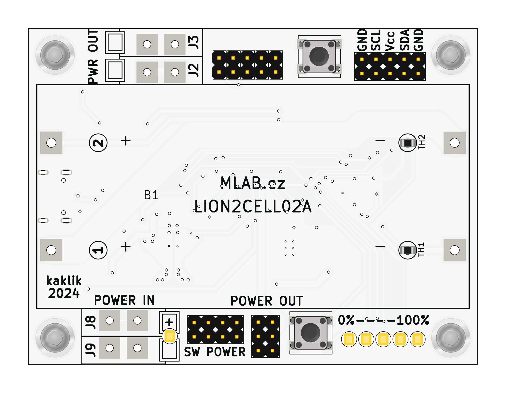

# LION2CELL02 - Dual-cell Li-Ion BMS with I2C interface and USB-C charging.

The LION2CELL02 module is designed to manage the charging and protection of the 2-cell Li-Ion battery stack. It incorporates advanced safe and efficient battery management features, utilizing the BQ40Z50-R2 fuel gauge and BQ25792 battery charger ICs.

## Features

The LION2CELL02 module include USB-C connector for quick charge connection. This allows for easy integration with USB-C power sources.

### BQ40Z50-R2 - Fuel Gauge

- Utilizes Impedance Track™ technology for accurate charge measurement.
- High-side protection N-FETs control.
- Integrated cell balancing during charging or at rest.
- Programmable protection features (voltage, current, temperature, charge timeout).
- JEITA, enhanced charging, and adaptive charging algorithms.
- Supports TURBO Mode 2.0 and Battery Trip Point (BTP).
- LED display for battery status.
- SMBus v1.1 interface for communication with the charger and host systems.

### BQ25792 Battery Charger

- Supports USB BC 1.2 charging standard.
- High-efficiency buck-boost charging for Li-Ion batteries.
- Programmable input current, charge current, and charge voltage.
- Integrated power path management.
- Protection features including overvoltage, undervoltage, overcurrent, and thermal protection.
- Low quiescent current for extended battery life.

## Power Delivery

The module supports BC 1.2 for charging. For the full USB Power Delivery (PD) support, an external USB PD controller is required. The MLAB [USBPDSINK01](https://www.mlab.cz/module/USBPDSINK01/) module can be used to enable PD functionality.

## Usage Instructions

1. Equip the LION2CELL02 module with pair of the suitable 16850 Li-Ion batteries.
2. Connect a USB-C power source to the module. For standard charging, ensure the power source complies with BC 1.2.
3. For USB PD, connect the USBPDSINK01 module to enable PD negotiation and charging.
4. Monitor the LED indicators for battery and charging status.
5. Connect to an MCU and use I2C/smbus for advanced features. 

## Safety and Protection

- The module includes multiple layers of protection for voltage, current, and temperature to ensure safe operation.
- Integrated cell balancing ensures equal charging across all cells, preventing overcharge and extending battery life.

## Applications

- UPS/battery backup systems
- Stand-alone measurement devices
- Scientific equipment

## Additional Resources

For further information, refer to the datasheets:
- [BQ40Z50-R2 Datasheet](https://www.ti.com/product/BQ40Z50-R2)
- [BQ25792 Datasheet](https://www.ti.com/product/BQ25792)

